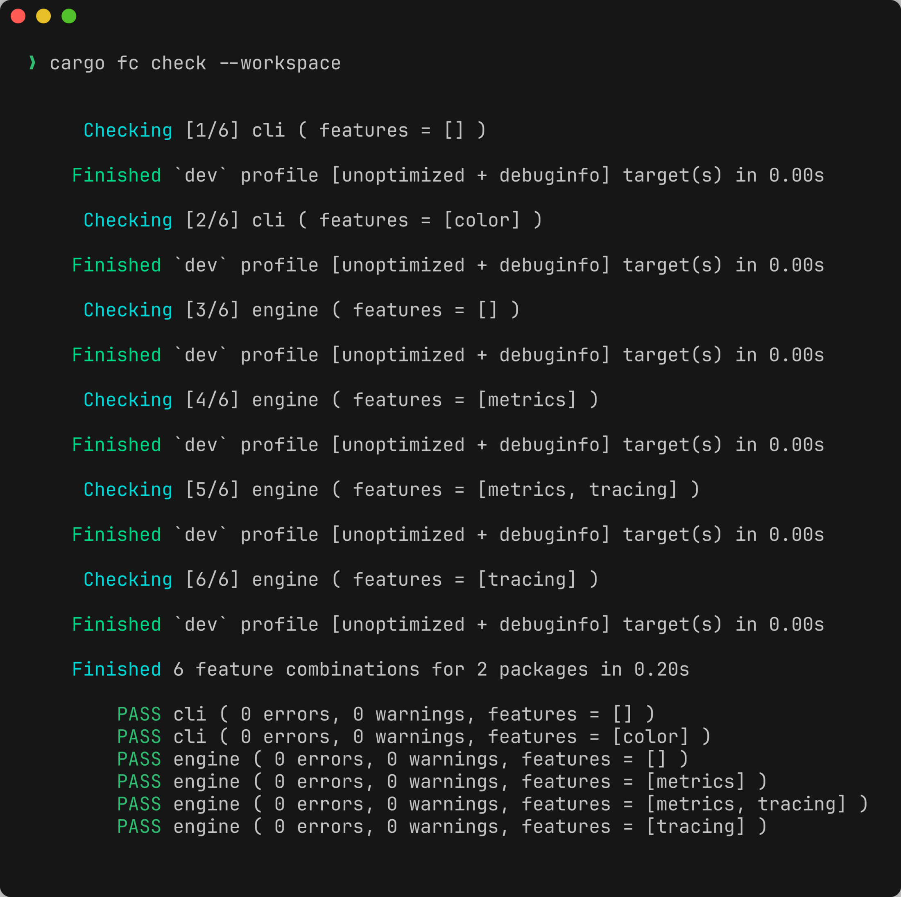
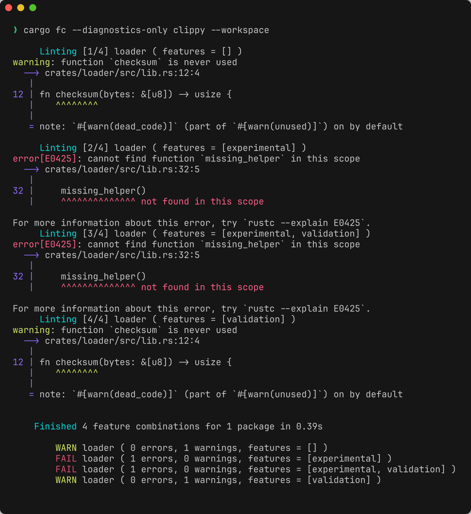
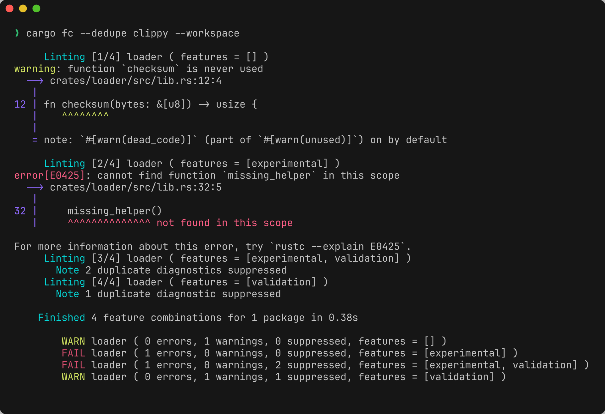
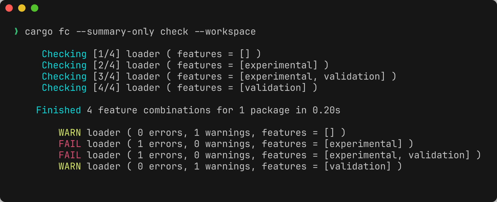
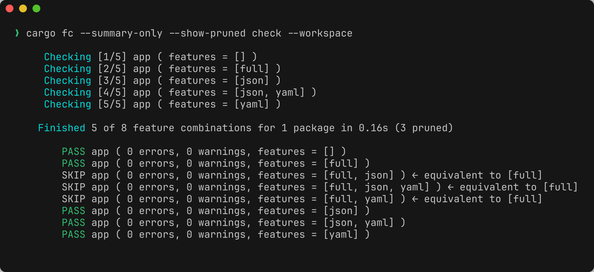
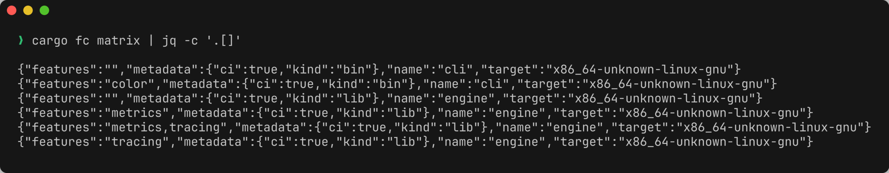
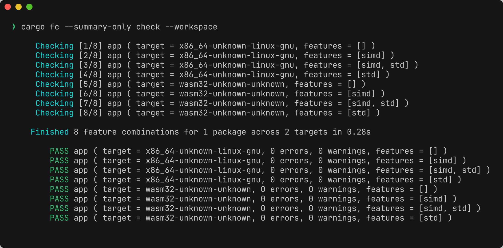

## cargo-feature-combinations

[](https://github.com/romnn/cargo-feature-combinations/actions/workflows/build.yaml)
[](https://github.com/romnn/cargo-feature-combinations/actions/workflows/test.yaml)
[](https://deps.rs/repo/github/romnn/cargo-feature-combinations)
[](https://docs.rs/cargo-feature-combinations)
[](https://crates.io/crates/cargo-feature-combinations)

Plugin for `cargo` to run commands against selected (or all) combinations of features.

The CLI is the supported interface. The Rust API exists for the binaries and
integration tests and has no stability guarantees.

<p align="center">
  
</p>

<details>
<summary>More screenshots</summary>

1. **`--diagnostics-only`** — only warnings/errors, no build noise

   

2. **`--dedupe`** — fold identical diagnostics across combinations

   

3. **`--summary-only`** — just the per-combination result table

   

4. **`--show-pruned`** — redundant combinations implied by other features are pruned

   

5. **`matrix`** — machine-readable feature matrix (one row per combination)

   

6. **configured `targets`** — every feature combination checked across each target triple

   

</details>

### Installation

```bash
brew install --cask romnn/tap/cargo-fc

# Or install from source
cargo install --locked cargo-feature-combinations
```

There is also an unofficial Nix package (community-maintained, not maintained by me):

```bash
nix-shell --packages cargo-feature-combinations
```

### Usage

Just use the command as if it was `cargo`:

```bash
cargo fc check
cargo fc test
cargo fc build

# All cargo arguments are passed along, except 
#   - `--all-features`
#   - `--features` 
#   - `--no-default-features` 
cargo fc check -p <my-crate> --all-targets
```

In addition, cargo-fc accepts new flags and the `matrix` subcommand.
To get an idea, consider these examples:

```bash
# Run tests and fail on the first failing combination of features
cargo fc --fail-fast test

# Show only diagnostics (warnings/errors), suppress build noise
cargo fc --diagnostics-only clippy

# Same as `--diagnostics-only`, but also deduplicate identical diagnostics across feature combinations
cargo fc --dedupe clippy

# Silence output and only show the final summary
cargo fc --summary-only build

# Print all combinations of features in JSON (useful for usage in github actions)
cargo fc matrix --pretty
```

For details, please refer to `--help`:

### Configuration

In your `Cargo.toml`, you can configure the feature combination matrix.
The following metadata key aliases are all supported:

```
[package.metadata.cargo-fc]              (recommended)
[package.metadata.fc]
[package.metadata.cargo-feature-combinations]
[package.metadata.feature-combinations]
```

#### Override model

Every setting resolves along **one precedence chain**, broadest to narrowest —
workspace → package, and within each: base → `subcommands.<cmd>` →
`target.'cfg(...)'` → `target.'cfg(...)'.subcommands.<cmd>`. A narrower scope
overrides a broader one (so a `target.'cfg(...)'` override beats a bare
`subcommands.<cmd>` one).

Wherever a setting is valid, it accepts the **same forms**, consistently:

- `key = value` — **override**: replace the inherited value exactly. For
  set-like values this is the array shorthand `key = [...]`, which is exactly
  equivalent to the patch op `key = { override = [...] }`.
- `key = { override = [...], add = [...], remove = [...] }` — explicit **patch**
  ops on a set-like value: `override` replaces the whole value, `add` unions
  into it, `remove` subtracts from it. (Scalars — bools and `driver` — only have
  `override`, i.e. `key = value`.)
- `replace = true` on a section — **reset**: ignore everything broader in the
  chain and start this section from defaults.

The matrix shows where each setting may be overridden (`✓`); a blank cell means
it does not apply in that scope (`*` marks the deprecated root-package
`exclude_packages` spelling — see note 2):

| setting | ws | ws·target | ws·sub | ws·tgt·sub | pkg | pkg·target | pkg·sub | pkg·tgt·sub |
|---|:--:|:--:|:--:|:--:|:--:|:--:|:--:|:--:|
| cargo-fc flags | ✓ | ✓ | ✓ | ✓ | ✓ | ✓ | ✓ | ✓ |
| feature matrix¹ |  |  |  |  | ✓ | ✓ | ✓ | ✓ |
| `exclude_packages`² | ✓ | ✓ | ✓ | ✓ | * |  |  |  |
| `targets` (list)³ | ✓ |  | ✓ |  | ✓ |  | ✓ |  |
| `expand_targets` |  |  | ✓ | ✓ |  |  | ✓ | ✓ |
| `driver` | ✓ | ✓ | ✓ | ✓ | ✓ | ✓ | ✓ | ✓ |
| `replace`⁴ |  | ✓ | ✓ | ✓ | ✓ | ✓ | ✓ | ✓ |

The places a setting is *not* overridable, and why:

1. **feature matrix** (`exclude_features`, `only_features`, `*_feature_sets`,
   `skip_optional_dependencies`, `no_empty_feature_set`, `max_combinations`,
   `matrix`) — a workspace
   isn't a crate, so it has no features to shape.
2. **`exclude_packages`** — a package can't exclude its *sibling* packages; run
   membership is a workspace-level decision. The bare `pkg` scope accepts
   `exclude_packages` only as a deprecated root-package spelling kept for
   backwards compatibility; it is folded into the workspace base set with a
   deprecation warning and is rejected in `pkg·target`, `pkg·sub`, and
   `pkg·tgt·sub`.
3. **`targets` (the list)** inside a `target.'cfg(...)'` section — circular: the
   section was selected *because* a target matched, so redefining the list there
   is self-referential. (Per-subcommand lists, e.g. "test only on host", are
   fine.)
4. **`replace`** at a *workspace base* — nothing broader exists for it to reset.
   (`replace` at a *package* base is fine: it discards the inherited workspace
   config for that package.)
5. **`expand_targets`** outside a `subcommands.<cmd>` table — it is a
   per-subcommand capability, not a base or target-wide setting.

Notes: **`driver`** resolves per (package × target × command); when
`aggregate_targets = true` runs several targets in one invocation, a per-target
`driver` forces serial execution. **`expand_targets`** (the capability formerly
spelled `targets = true|false` on a subcommand) gates whether cargo-fc drives a
command across the target matrix at all.

For example:

```toml
[package.metadata.cargo-fc]

# Exclude groupings of features that are incompatible or do not make sense
exclude_feature_sets = [["foo", "bar"]]

# To exclude only the empty feature set from the matrix, you can either enable
# `no_empty_feature_set = true` or explicitly list an empty set here:
exclude_feature_sets = [[]]

# Exclude features from the feature combination matrix
exclude_features = ["default", "full"]

# Skip implicit features that correspond to optional dependencies from the
# matrix.
#
# When enabled, the implicit features that Cargo generates for optional
# dependencies (of the form `foo = ["dep:foo"]` in the feature graph) are
# removed from the combinatorial matrix. This mirrors the behaviour of the
# `skip_optional_dependencies` flag in the `cargo-all-features` crate.
skip_optional_dependencies = true

# Include features in the feature combination matrix
#
# These features will be added to every generated feature combination.
# This does not restrict which features are varied for the combinatorial
# matrix. To restrict the matrix to a specific allowlist of features, use
# `only_features`.
include_features = ["feature-that-must-always-be-set"]

# Only consider these features when generating the combinatorial matrix.
#
# When set, features not listed here are ignored for the combinatorial matrix.
# When empty, all package features are considered.
only_features = ["default", "full"]

# In the end, always add these exact combinations to the overall feature matrix, 
# unless one is already present there.
#
# Non-existent features are ignored. Other configuration options are ignored.
include_feature_sets = [
    ["foo-a", "bar-a", "other-a"],
]

# Allow only the listed feature sets.
#
# When this list is non-empty, the feature matrix will consist exactly of the
# configured sets (after dropping non-existent features). No powerset is
# generated.
allow_feature_sets = [
    ["hydrate"],
    ["ssr"],
]

# When enabled, never include the empty feature set (no `--features`), even if
# it would otherwise be generated.
no_empty_feature_set = true

# Override the default safety limit of 100000 generated feature combinations.
max_combinations = 250000

# When at least one isolated feature set is configured, stop taking all project 
# features as a whole, and instead take them in these isolated sets. Build a 
# sub-matrix for each isolated set, then merge sub-matrices into the overall 
# feature matrix. If any two isolated sets produce an identical feature 
# combination, such combination will be included in the overall matrix only once.
#
# This feature is intended for projects with large number of features, sub-sets 
# of which are completely independent, and thus don’t need cross-play.
#
# Non-existent features are ignored. Other configuration options are still 
# respected.
isolated_feature_sets = [
    ["foo-a", "foo-b", "foo-c"],
    ["bar-a", "bar-b"],
    ["other-a", "other-b", "other-c"],
]

# Optional: Custom metadata for `cargo fc matrix` output.
# It appears under the row's `metadata` key.
# $ cargo fc matrix --pretty
#   [
#     { "features": "", "metadata": { "kind": "ci" }, "name": "my-crate", "target": "x86_64-unknown-linux-gnu" },
#     { "features": "a", "metadata": { "kind": "ci" }, "name": "my-crate", "target": "x86_64-unknown-linux-gnu" },
#     { "features": "b", "metadata": { "kind": "ci" }, "name": "my-crate", "target": "x86_64-unknown-linux-gnu" },
#     { "features": "a,b", "metadata": { "kind": "ci" }, "name": "my-crate", "target": "x86_64-unknown-linux-gnu" },
#   ]
matrix = { kind = "ci" }

# Optional: Matrix metadata can also be configured in its own section.
# $ cargo fc matrix --pretty
#   [{
#       "features": "",
#       "metadata": {
#         "requires-gpu": false,
#         "value-for-this-crate": "will show up in the feature matrix"
#       },
#       "name": "my-crate",
#       "target": "x86_64-unknown-linux-gnu"
#    }, .. ]
[package.metadata.cargo-fc.matrix]
value-for-this-crate = "will show up in the feature matrix"
requires-gpu = false
```

When using a cargo workspace, you can also exclude packages in your workspace `Cargo.toml`:

```toml
[workspace.metadata.cargo-fc]
# Exclude packages in the workspace metadata, or the metadata of the *root* package.
exclude_packages = ["package-a", "package-b"]
```

<details>
<summary>Example: skipping optional dependency features</summary>

```toml
[features]
default = []
core = []
cli = ["core"]

[dependencies]
tokio = { version = "1", optional = true }
serde = { version = "1", optional = true }

[package.metadata.cargo-fc]
exclude_features = ["default"]
skip_optional_dependencies = true
```

With this configuration, the feature matrix will only vary the `core` and
`cli` features. The implicit `tokio` and `serde` features that correspond to
optional dependencies are excluded from the matrix, avoiding a combinatorial
explosion over integration features. If you still want to test specific
combinations that include `tokio` or `serde`, you can list them explicitly in
`include_feature_sets`.

</details>

---

### Configured targets

By default `cargo fc` runs for a single effective target (the same one Cargo
would pick: `--target`, then `CARGO_BUILD_TARGET`, then the host). You can
instead declare a list of target triples to check by default, turning the run
into a full matrix of

```text
selected packages × effective targets × feature combinations
```

Declare workspace-wide targets in the workspace `Cargo.toml`:

```toml
[workspace.metadata.cargo-fc]
targets = [
  "x86_64-unknown-linux-gnu",
  "x86_64-pc-windows-msvc",
  "aarch64-apple-darwin",
]
```

Individual packages can override the workspace list, or opt out of it:

```toml
[package.metadata.cargo-fc]
# Run this package only on wasm (overrides the workspace list, does not merge).
targets = ["wasm32-unknown-unknown"]

# Or opt out of configured targets entirely and use the single effective target:
# targets = []
```

- **missing key** — inherit the workspace target list,
- **`targets = []`** — opt out of the workspace list and use the single
  effective target (`CARGO_BUILD_TARGET`, then host),
- **`targets = ["…"]`** — this package's own target list (overrides, not
  merges with, the workspace list).

`targets` only selects which targets are visited. The
[`target.'cfg(...)'`](#target-specific-configuration) overrides below still
shape the feature matrix for each concrete target.

#### Precedence

When the selected command supports targets, each package's targets are resolved as:

1. an explicit Cargo `--target <triple>` (wins globally for that run),
2. the package's `targets`,
3. the workspace `targets`,
4. `CARGO_BUILD_TARGET`,
5. the host target.

> [!IMPORTANT]
> Configured target lists intentionally take precedence over
> `CARGO_BUILD_TARGET` — repository config is the declarative matrix and should
> not be silently collapsed by a developer's ambient environment. This differs
> from Cargo's own `[build].target` precedence. To run a single target for one
> invocation, pass an explicit `--target <triple>`, which overrides all
> configured lists, or pass `--no-targets` to ignore the configured lists and
> fall back to Cargo's default single target.

#### Which commands receive configured targets

Configured targets are applied only to commands that accept Cargo's `--target`
flag. Built-in subcommands cargo-fc recognizes — `check`, `clippy`, `build`,
`doc`, `test`, `run` (and `cargo fc matrix`) — get this capability
automatically by default.

cargo-fc resolves cargo command aliases from your `.cargo/config.toml` before
running, so an alias that expands to a built-in inherits the built-in's
capability automatically. With `lint = "clippy --all-targets --no-deps"`,
`cargo fc lint` behaves exactly like `cargo fc clippy` — no opt-in required.

A custom subcommand that does **not** resolve to a built-in still needs an
explicit declaration:

```toml
[workspace.metadata.cargo-fc.subcommands.my-custom-cmd]
expand_targets = true
```

For well-known cargo plugins such as `nextest`, `audit`, `deny`, `machete`,
`udeps`, and `leptos`, cargo-fc suppresses the capability hint by default to
avoid noisy output. This does not grant target capability; opt in or out
explicitly with the same `subcommands.<name>` table when you want a local
policy.

The same table can override built-in defaults. For example, lint every
configured target but keep `cargo fc build` on the single effective target:

```toml
[workspace.metadata.cargo-fc.subcommands.build]
expand_targets = false
```

For built-in short aliases, the long command's policy also applies unless the
short alias has its own entry. If configured targets exist but the selected
command lacks this capability by default, cargo-fc warns once and falls back to
the single effective target. An explicit `expand_targets = false` opt-out is quiet.

#### Configurable cargo-fc flags

Cargo-fc boolean flags can be configured in `Cargo.toml` with the same name as
the CLI flag, using `_` instead of `-`. CLI flags still win for one invocation.

```toml
[workspace.metadata.cargo-fc]
dedupe = true
fail_fast = true

[package.metadata.cargo-fc]
pedantic = false

[package.metadata.cargo-fc.target.'cfg(target_os = "windows")']
errors_only = true

[package.metadata.cargo-fc.target.'cfg(target_os = "windows")'.subcommands.clippy]
dedupe = false

[workspace.metadata.cargo-fc.subcommands.my-custom-cmd]
dedupe = true
```

The configurable flag keys are:

```toml
summary_only = true
diagnostics_only = true
dedupe = true
verbose = true
pedantic = true
errors_only = true
packages_only = true
fail_fast = true
no_prune_implied = true
prune_implied = true
show_pruned = true
aggregate_targets = true
no_targets = true
install_missing_targets = true
only_packages_with_lib_target = true
```

`dedupe = true` implies diagnostics-only output. `prune_implied` is the positive
config spelling for `no_prune_implied`; configure only one spelling in a given
scope.

Flag precedence is broad-to-narrow:

1. workspace config,
2. matching workspace target config,
3. package config,
4. matching package target config,
5. explicit CLI flags.

At each config level, a matching `subcommands.<name>` table is applied after
that level's plain flags, so command-specific defaults override broader
defaults. Alias config for the raw command token wins; otherwise cargo-fc uses
the resolved alias target when one is known.

Broad config-driven diagnostics apply only to commands where diagnostics-only
mode is safe by default. Built-in `build`, `check`, `clippy`, and `doc` get
broad `diagnostics_only = true` and `dedupe = true` settings. Built-in `test`,
`run`, and unresolved custom commands do not, because they are not reliable
JSON-diagnostics-only commands. Aliases that resolve to a safe built-in inherit
that behavior.

For a custom command, unresolved alias, or a built-in such as `test`, opt in by
setting the behavior in that command's own table:

```toml
[workspace.metadata.cargo-fc.subcommands.my-custom-cmd]
dedupe = true
```

Known cargo plugins get the same quiet treatment as target capability hints:
cargo-fc does not assume they are diagnostics-safe, but it also does not warn
when broad diagnostics defaults are ignored for them.

Subcommand-local diagnostics flags are explicit and are applied even for
commands that are not safe by default. `dedupe = true` implies
`diagnostics_only = true`; setting `dedupe = true` together with
`diagnostics_only = false` is rejected as contradictory. Use
`diagnostics_only = false` or `dedupe = false` in a narrower scope to override a
broader default. Explicit CLI flags are always forwarded.

> [!WARNING]
> The `targets` list is shared by all target-capable commands. `check`/`clippy`
> only need the target's `rustc`, but `test`/`run` **execute** the binary and so
> cannot run a foreign target — keep them host-only (narrow with `--target` or
> `--no-targets`). `build` links and, like `clippy`, cross-compiles native-C
> dependencies; see the build driver below.

#### Build driver (cross-compiling native dependencies)

Cross-compiling a crate with native-C build dependencies (e.g. `aws-lc-sys` via
`rustls`) needs a cross C toolchain — the host `cc` can't target another OS. To
make that transparent, **when any non-host target is planned cargo-fc invokes
[`cargo-zigbuild`](https://github.com/rust-cross/cargo-zigbuild) instead of plain
`cargo`**, so zig supplies the cross C compiler and linker for every target. You
must have `cargo-zigbuild` (and `zig`) installed; host-only runs use plain
`cargo`.

Override the driver with `--driver <bin>` or in config:

```toml
[workspace.metadata.cargo-fc]
driver = "cargo-zigbuild"   # the cross-compile default; set "cargo" to opt out

# `driver` is a normal scalar setting, so it follows the same precedence chain
# as everything else (see "Override model"): a package, a `target.'cfg(...)'`, or
# a `subcommands.<cmd>` may override it. cargo-fc launches each package × target
# × command separately, so each can resolve its own driver:
[package.metadata.cargo-fc.target.'cfg(target_arch = "wasm32")']
driver = "cargo"            # this one crate builds wasm with plain cargo
```

`--driver` wins over all config; within config a narrower scope wins over a
broader one, and both win over the automatic choice. Point it at any cargo
wrapper (`cross`, `cargo-careful`, …), or set `cargo` to force plain cargo even
when cross-compiling. If the selected driver is missing, cargo-fc warns with the
install/override options before returning the spawn error.

> `--aggregate-targets` batches a package's targets into one Cargo invocation,
> which can only use one driver — so if a package resolves different drivers per
> target, cargo-fc runs those targets serially instead.

#### Installing missing Rust targets

By default cargo-fc does not mutate the Rust toolchain. To install missing
configured target components via rustup before running a command, opt in per
invocation:

```bash
cargo fc check --install-missing-targets
```

Or opt in for the workspace:

```toml
[workspace.metadata.cargo-fc]
install_missing_targets = true
```

#### Per-target workspace package selection

Workspace package exclusions can vary by target, using the same `cfg(...)`
selectors and patch semantics as the feature overrides:

```toml
[workspace.metadata.cargo-fc]
targets = ["x86_64-unknown-linux-gnu", "wasm32-unknown-unknown"]

[workspace.metadata.cargo-fc.target.'cfg(target_arch = "wasm32")']
exclude_packages = { add = ["native-cli"] }

[workspace.metadata.cargo-fc.target.'cfg(target_os = "linux")']
exclude_packages = { add = ["wasm-app"] }
fail_fast = false
```

Workspace target overrides may patch `exclude_packages` and set cargo-fc flag
defaults for matching targets. They apply to every concrete effective target —
including single-target runs selected by `--target`, `CARGO_BUILD_TARGET`, or
the host.

### Target-specific configuration

You can override configuration for specific targets using Cargo-style `cfg(...)` expressions.
Overrides are configured under:

```toml
[package.metadata.cargo-fc.target.'cfg(...)']
```

Example (exclude different features per OS):

```toml
[package.metadata.cargo-fc]
exclude_features = ["default"]

[package.metadata.cargo-fc.target.'cfg(target_os = "linux")']
exclude_features = { add = ["metal"] }

[package.metadata.cargo-fc.target.'cfg(target_os = "macos")']
exclude_features = { add = ["cuda"] }
```

Patch semantics for collection-like keys such as `exclude_features`, `include_features`,
`only_features`, `*_feature_sets`:

- **Array syntax is always an override**
  - `exclude_features = ["cuda"]` replaces the entire value.
  - This is equivalent to `exclude_features = { override = ["cuda"] }`.
- **Patch object syntax is explicit**
  - Override (replace the entire value):
    - `exclude_features = { override = ["cuda"] }`
  - Add (union with the base value):
    - `exclude_features = { add = ["cuda"] }`
  - Remove (subtract from the base value):
    - `exclude_features = { remove = ["cuda"] }`

Patches are applied in order: override (or base), then remove, then add.
If a value appears in both `add` and `remove`, add wins.

When multiple target override sections match (e.g. `cfg(unix)` and `cfg(target_os = "linux")`),
their `add` and `remove` sets are unioned. Conflicting `override` values result in an error.

Matrix metadata tables merge recursively. Other matrix metadata values,
including arrays, replace the base value.

##### `replace = true`

If a matching target override sets `replace = true`, resolution starts from a fresh default
configuration (instead of inheriting from the base config). To avoid confusion, when
`replace = true` is set, patchable fields in that same section must not use `add` or
`remove` (only override is allowed).

<details>
<summary>Example: Start from fresh config with `replace=true`</summary>

```toml
[package.metadata.cargo-fc]
exclude_features = ["default"]
isolated_feature_sets = [
  ["gpu"],
  ["ui"],
]
skip_optional_dependencies = true

[package.metadata.cargo-fc.target.'cfg(target_os = "linux")']
replace = true

# Start from a fresh default config on Linux: `isolated_feature_sets` and
# `skip_optional_dependencies` are not inherited from the base config.
exclude_features = ["default", "cuda"] # using array shorthand, i.e. override
```
</details>

### Command-specific configuration

Just as you can override configuration per target triple, you can override it
per cargo subcommand under:

```toml
[package.metadata.cargo-fc.subcommands.<command>]
```

A subcommand override accepts the **same feature-matrix keys as a target
override** — `exclude_features`, `include_features`, `only_features`,
`*_feature_sets`, `skip_optional_dependencies`, `no_empty_feature_set`, and
`matrix` — with identical patch semantics (`key = [...]` or `{ override = [...] }`
to replace; `{ add = [...] }` / `{ remove = [...] }` for incremental edits). This lets the feature combinations
built for one command differ from another. For example, enable a heavy `gpu`
feature when building, but skip it when testing:

```toml
[package.metadata.cargo-fc]
# `gpu` is part of the matrix by default (e.g. for `cargo fc build`).

[package.metadata.cargo-fc.subcommands.test]
# ...but never test the `gpu` combinations.
exclude_features = { add = ["gpu"] }
```

Or restrict `cargo fc test` to a single focused feature set:

```toml
[package.metadata.cargo-fc.subcommands.test]
only_features = ["core"]
```

The override applies to that command only. Built-in short aliases (`t` → `test`,
`b` → `build`, …) and your own `.cargo/config.toml` aliases that resolve to a
built-in inherit the override automatically, matching how cargo-fc resolves the
`targets` capability and flag defaults.

Target and subcommand overrides compose. A
`target.'cfg(...)'.subcommands.<command>` section applies only when **both** the
target matches and the command is selected:

```toml
[package.metadata.cargo-fc.target.'cfg(target_os = "linux")'.subcommands.test]
exclude_features = { add = ["cuda"] }
```

Feature-matrix layers resolve broad-to-narrow, mirroring flag precedence — later
layers override earlier ones:

1. package config,
2. matching package `subcommands.<command>`,
3. matching package `target.'cfg(...)'`,
4. matching package `target.'cfg(...)'.subcommands.<command>`.

> [!NOTE]
> Feature sets are per package, so these feature-matrix keys are only accepted
> in **package**-scope subcommand tables. Workspace-scope subcommand tables
> (`[workspace.metadata.cargo-fc.subcommands.<command>]`) continue to accept only
> the `targets` capability and cargo-fc flags.

---

### Usage with github-actions

The github-actions [matrix](https://docs.github.com/en/actions/using-jobs/using-a-matrix-for-your-jobs) feature can be used together with `cargo fc` to more efficiently test combinations of features in CI. See [GITHUB_ACTIONS.md](./docs/GITHUB_ACTIONS.md) for more information.

### Local development

For local development and testing, you can point `cargo fc` to another project using
the `--manifest-path` flag.

```bash
cargo run -- cargo check --manifest-path ../path/to/Cargo.toml
cargo run -- cargo matrix --manifest-path ../path/to/Cargo.toml --pretty
```
