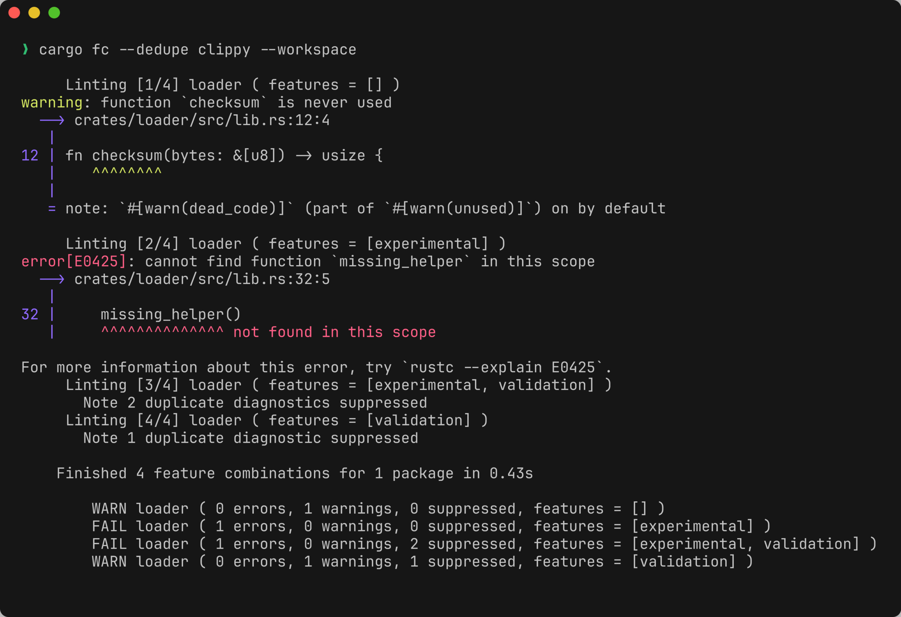
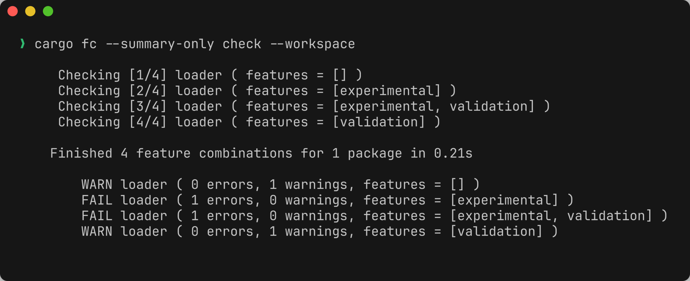
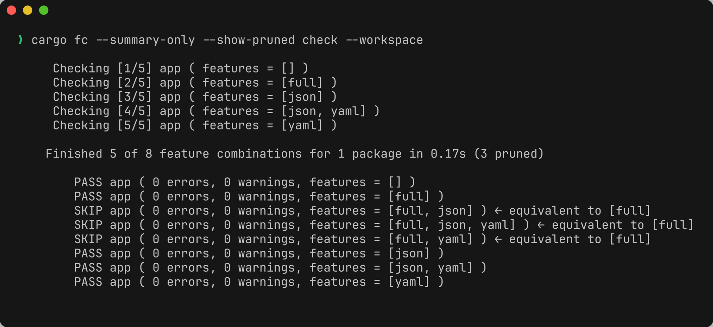
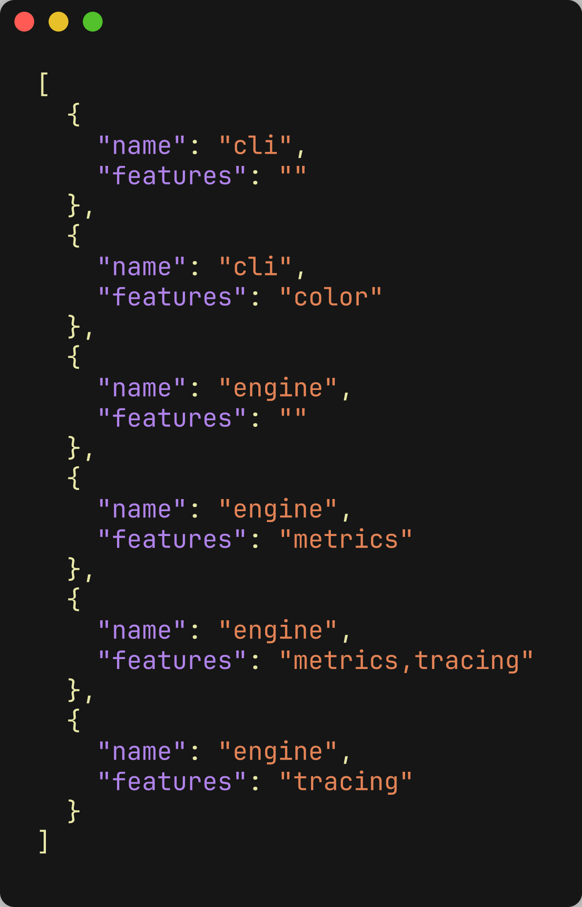

## cargo-feature-combinations

[](https://github.com/romnn/cargo-feature-combinations/actions/workflows/build.yaml)
[](https://github.com/romnn/cargo-feature-combinations/actions/workflows/test.yaml)
[](https://deps.rs/repo/github/romnn/cargo-feature-combinations)
[](https://docs.rs/cargo-feature-combinations)
[](https://crates.io/crates/cargo-feature-combinations)

Plugin for `cargo` to run commands against selected (or all) combinations of features.

<p align="center">
  
</p>

### Installation

```bash
brew install --cask romnn/tap/cargo-fc

# Or install from source
cargo install --locked cargo-feature-combinations
```

There is also an unofficial Nix package (community-maintained, not maintained by me):

```bash
nix-shell --packages cargo-feature-combinations
```

### Usage

Just use the command as if it was `cargo`:

```bash
cargo fc check
cargo fc test
cargo fc build

# All cargo arguments are passed along, except 
#   - `--all-features`
#   - `--features` 
#   - `--no-default-features` 
cargo fc check -p <my-crate> --all-targets
```

In addition, there are a few new flags and the `matrix` subcommand.
To get an idea, consider these examples:

```bash
# Run tests and fail on the first failing combination of features
cargo fc --fail-fast test

# Show only diagnostics (warnings/errors), suppress build noise
cargo fc --diagnostics-only clippy

# Same as `--diagnostics-only`, but also deduplicate identical diagnostics across feature combinations
cargo fc --dedupe clippy

# Silence output and only show the final summary
cargo fc --summary-only build

# Print all combinations of features in JSON (useful for usage in github actions)
cargo fc matrix --pretty
```

<details>
<summary>More screenshots</summary>

1. **`--diagnostics-only`** — only warnings/errors, no build noise

   

2. **`--dedupe`** — fold identical diagnostics across combinations

   

3. **`--summary-only`** — just the per-combination result table

   

4. **`--show-pruned`** — redundant combinations implied by other features are pruned

   

5. **`matrix`** — machine-readable feature matrix (one row per combination)

   

</details>

For details, please refer to `--help`:

```bash
$ cargo fc --help

USAGE:
    cargo fc [+toolchain] [SUBCOMMAND] [SUBCOMMAND_OPTIONS]
    cargo fc [+toolchain] [OPTIONS] [CARGO_OPTIONS] [CARGO_SUBCOMMAND]

SUBCOMMAND:
    matrix                  Print JSON feature combination matrix to stdout
        --pretty            Print pretty JSON

OPTIONS:
    --help                  Print help information
    --diagnostics-only      Show only diagnostics (warnings/errors) per
                            feature combination, suppressing build noise
    --dedupe                Like --diagnostics-only, but also deduplicate
                            identical diagnostics across feature combinations
    --summary-only          Hide cargo output and only show the final summary
    --fail-fast             Fail fast on the first bad feature combination
    --exclude-package       Exclude a package from feature combinations
    --only-packages-with-lib-target
                            Only consider packages with a library target
    --errors-only           Allow all warnings, show errors only (-Awarnings)
    --pedantic              Treat warnings like errors in summary and
                            when using --fail-fast
    --no-prune-implied      Disable pruning of redundant feature combinations
    --show-pruned           Show pruned feature combinations in the summary
    --aggregate-targets     Batch a combination's configured targets into one
                            Cargo invocation (faster on many cores; group-level
                            attribution). See "Configured targets" below.
```

### Configuration

In your `Cargo.toml`, you can configure the feature combination matrix.
The following metadata key aliases are all supported:

```
[package.metadata.cargo-fc]              (recommended)
[package.metadata.fc]
[package.metadata.cargo-feature-combinations]
[package.metadata.feature-combinations]
```

For example:

```toml
[package.metadata.cargo-fc]

# Exclude groupings of features that are incompatible or do not make sense
exclude_feature_sets = [ ["foo", "bar"], ] # formerly "skip_feature_sets"

# To exclude only the empty feature set from the matrix, you can either enable
# `no_empty_feature_set = true` or explicitly list an empty set here:
exclude_feature_sets = [[]]

# Exclude features from the feature combination matrix
exclude_features = ["default", "full"] # formerly "denylist"

# Skip implicit features that correspond to optional dependencies from the
# matrix.
#
# When enabled, the implicit features that Cargo generates for optional
# dependencies (of the form `foo = ["dep:foo"]` in the feature graph) are
# removed from the combinatorial matrix. This mirrors the behaviour of the
# `skip_optional_dependencies` flag in the `cargo-all-features` crate.
skip_optional_dependencies = true

# Include features in the feature combination matrix
#
# These features will be added to every generated feature combination.
# This does not restrict which features are varied for the combinatorial
# matrix. To restrict the matrix to a specific allowlist of features, use
# `only_features`.
include_features = ["feature-that-must-always-be-set"]

# Only consider these features when generating the combinatorial matrix.
#
# When set, features not listed here are ignored for the combinatorial matrix.
# When empty, all package features are considered.
only_features = ["default", "full"]

# In the end, always add these exact combinations to the overall feature matrix, 
# unless one is already present there.
#
# Non-existent features are ignored. Other configuration options are ignored.
include_feature_sets = [
    ["foo-a", "bar-a", "other-a"],
] # formerly "exact_combinations"

# Allow only the listed feature sets.
#
# When this list is non-empty, the feature matrix will consist exactly of the
# configured sets (after dropping non-existent features). No powerset is
# generated.
allow_feature_sets = [
    ["hydrate"],
    ["ssr"],
]

# When enabled, never include the empty feature set (no `--features`), even if
# it would otherwise be generated.
no_empty_feature_set = true

# When at least one isolated feature set is configured, stop taking all project 
# features as a whole, and instead take them in these isolated sets. Build a 
# sub-matrix for each isolated set, then merge sub-matrices into the overall 
# feature matrix. If any two isolated sets produce an identical feature 
# combination, such combination will be included in the overall matrix only once.
#
# This feature is intended for projects with large number of features, sub-sets 
# of which are completely independent, and thus don’t need cross-play.
#
# Non-existent features are ignored. Other configuration options are still 
# respected.
isolated_feature_sets = [
    ["foo-a", "foo-b", "foo-c"],
    ["bar-a", "bar-b"],
    ["other-a", "other-b", "other-c"],
]

# Optional: Additional metadata merged into `cargo fc matrix` output
# $ cargo fc matrix --pretty
#   [
#     { "name": "my-crate", "features": "", "kind": "ci" },
#     { "name": "my-crate", "features": "a", "kind": "ci" },
#     { "name": "my-crate", "features": "b", "kind": "ci" },
#     { "name": "my-crate", "features": "a,b", "kind": "ci" },
#   ]
matrix = { kind = "ci" }

# Optional: The `matrix` metadata from before can also be its own section
# $ cargo fc matrix --pretty
#   [{
#       "requires-gpu": false,
#       "value-for-this-crate": "will show up in the feature matrix",
#       ..
#    }, .. ]
[package.metadata.cargo-fc.matrix]
value-for-this-crate = "will show up in the feature matrix"
requires-gpu = false
```

When using a cargo workspace, you can also exclude packages in your workspace `Cargo.toml`:

```toml
[workspace.metadata.cargo-fc]
# Exclude packages in the workspace metadata, or the metadata of the *root* package.
exclude_packages = ["package-a", "package-b"]
```

<details>
<summary>Example: skipping optional dependency features</summary>

```toml
[features]
default = []
core = []
cli = ["core"]

[dependencies]
tokio = { version = "1", optional = true }
serde = { version = "1", optional = true }

[package.metadata.cargo-fc]
exclude_features = ["default"]
skip_optional_dependencies = true
```

With this configuration, the feature matrix will only vary the `core` and
`cli` features. The implicit `tokio` and `serde` features that correspond to
optional dependencies are excluded from the matrix, avoiding a combinatorial
explosion over integration features. If you still want to test specific
combinations that include `tokio` or `serde`, you can list them explicitly in
`include_feature_sets`.

</details>

---

### Configured targets

By default `cargo fc` runs for a single effective target (the same one Cargo
would pick: `--target`, then `CARGO_BUILD_TARGET`, then the host). You can
instead declare a list of target triples to check by default, turning the run
into a full matrix of

```text
selected packages × effective targets × feature combinations
```

so that a plain local `cargo fc check` exercises exactly the target cfg views
that CI exercises.

Declare workspace-wide targets in the workspace `Cargo.toml`:

```toml
[workspace.metadata.cargo-fc]
targets = [
  "x86_64-unknown-linux-gnu",
  "x86_64-pc-windows-msvc",
  "aarch64-apple-darwin",
]
```

Individual packages can override the workspace list, or opt out of it:

```toml
[package.metadata.cargo-fc]
# Run only this package on wasm (overrides the workspace list, does not merge).
targets = ["wasm32-unknown-unknown"]

# Or opt out of configured targets entirely and use the single effective target:
# targets = []
```

- **missing key** — inherit the workspace target list,
- **`targets = []`** — opt out of the workspace list and use the single
  effective target (`CARGO_BUILD_TARGET`, then host),
- **`targets = ["…"]`** — this package's own target list (overrides, not
  merges with, the workspace list).

`targets` only selects which targets are visited. The
[`target.'cfg(...)'`](#target-specific-configuration) overrides below still
shape the feature matrix for each concrete target.

#### Precedence

When the selected command supports targets, each package's targets are resolved as:

1. an explicit Cargo `--target <triple>` (wins globally for that run),
2. the package's `targets`,
3. the workspace `targets`,
4. `CARGO_BUILD_TARGET`,
5. the host target.

> [!IMPORTANT]
> Configured target lists intentionally take precedence over
> `CARGO_BUILD_TARGET` — repository config is the declarative matrix and should
> not be silently collapsed by a developer's ambient environment. This differs
> from Cargo's own `[build].target` precedence. To run a single target for one
> invocation, pass an explicit `--target <triple>`, which overrides all
> configured lists.

#### Which commands receive configured targets

Configured targets are applied only to commands that accept Cargo's `--target`
flag. Built-in subcommands cargo-fc recognizes — `check`, `clippy`, `build`,
`doc`, `test`, `run` (and `cargo fc matrix`) — get this capability
automatically.

Unknown aliases and custom subcommands do **not** receive configured targets
unless you opt them in. cargo-fc will not guess that `cargo lint` means
`cargo clippy`; instead, declare it:

```toml
[workspace.metadata.cargo-fc.subcommands.lint]
targets = true
```

If configured targets exist but the selected command lacks this capability,
cargo-fc warns once and falls back to the single effective target.

> [!WARNING]
> The `targets` list is shared by all target-capable commands. It is motivated
> by `check`/`clippy` (which only need the target's `rustc`), but it also
> applies to `build` (needs a linker), and to `test`/`run` (which execute and
> therefore usually fail for foreign targets). Narrow a single run with an
> explicit `--target <triple>` when needed. Missing targets surface Cargo's own
> `rustup target add <triple>` hint; cargo-fc does not install targets for you.

#### Per-target workspace package selection

Workspace package exclusions can vary by target, using the same `cfg(...)`
selectors and patch semantics as the feature overrides:

```toml
[workspace.metadata.cargo-fc]
targets = ["x86_64-unknown-linux-gnu", "wasm32-unknown-unknown"]

[workspace.metadata.cargo-fc.target.'cfg(target_arch = "wasm32")']
exclude_packages = { add = ["native-cli"] }

[workspace.metadata.cargo-fc.target.'cfg(target_os = "linux")']
exclude_packages = { add = ["wasm-app"] }
```

Workspace target overrides may patch `exclude_packages` only, and they apply to
every concrete effective target — including single-target runs selected by
`--target`, `CARGO_BUILD_TARGET`, or the host.

#### Matrix output

Every `cargo fc matrix` row now includes a `target` field:

```json
{ "name": "my-crate", "target": "x86_64-pc-windows-msvc", "features": "serde,cli" }
```

`target` is a reserved built-in key: if your `matrix` metadata already defines
`target`, the built-in value wins and cargo-fc warns. (This is an additive
schema change — runs with no configured targets still emit `target` = the host
triple on every row.)

#### Execution modes

cargo-fc is single-threaded and never spawns concurrent Cargo processes; it
relies on Cargo's own scheduler to use your cores. There are two modes:

- **serial per-target (default)** — one Cargo invocation per
  `(package, target, combination)`. Output stays live and every PASS/FAIL,
  diagnostic, and dedupe note is attributed to exactly one target.
- **`--aggregate-targets`** — one Cargo invocation per `(package, combination)`
  that passes every target sharing that combination as repeated `--target`
  flags, letting Cargo overlap their build graphs. Faster on many-core machines,
  but results are reported per target *group* (`targets = [a, b, …]`) rather
  than per target.

A worker pool of concurrent Cargo processes was measured and rejected: with a
shared `target/` directory, Cargo serializes on its build-directory lock, so
concurrent `--target` builds give no speedup; per-target `CARGO_TARGET_DIR`
workers do parallelize but recompile shared host artifacts per target (a small
win on many cores, ~28% slower on 2 cores, plus doubled disk). A single
multi-target invocation (aggregate mode) is the only approach that is faster on
many cores and never slower on small CI runners.

`--aggregate-targets` falls back to serial per-target when:

- the subcommand is `run` (Cargo rejects multiple `--target` for `run`),
- pruned summaries are enabled (`--show-pruned` or `show_pruned` in config) —
  pruning is target-specific,
- only one target is effectively planned,

and it has no effect on `cargo fc matrix` (rows are always per target). In each
case cargo-fc prints a short note. Aggregate warning/error counts are for the
whole target group and may differ from serial per-target counts; pair
`--aggregate-targets` with `--dedupe` for the cleanest diagnostics output.

---

### Target-specific configuration

You can override configuration for specific targets using Cargo-style `cfg(...)` expressions.
Overrides are configured under:

```toml
[package.metadata.cargo-fc.target.'cfg(...)']
```

Example (exclude different features per OS):

```toml
[package.metadata.cargo-fc]
exclude_features = ["default"]

[package.metadata.cargo-fc.target.'cfg(target_os = "linux")']
exclude_features = { add = ["metal"] }

[package.metadata.cargo-fc.target.'cfg(target_os = "macos")']
exclude_features = { add = ["cuda"] }
```

Patch semantics for collection-like keys such as `exclude_features`, `include_features`,
`only_features`, `*_feature_sets`:

- **Array syntax is always an override**
  - `exclude_features = ["cuda"]` replaces the entire value.
  - This is equivalent to `exclude_features = { override = ["cuda"] }`.
- **Patch object syntax is explicit**
  - Override (replace the entire value):
    - `exclude_features = { override = ["cuda"] }`
  - Add (union with the base value):
    - `exclude_features = { add = ["cuda"] }`
  - Remove (subtract from the base value):
    - `exclude_features = { remove = ["cuda"] }`

Patches are applied in order: override (or base), then remove, then add.
If a value appears in both `add` and `remove`, add wins.

When multiple target override sections match (e.g. `cfg(unix)` and `cfg(target_os = "linux")`),
their `add` and `remove` sets are unioned. Conflicting `override` values result in an error.

##### `replace = true`

If a matching target override sets `replace = true`, resolution starts from a fresh default
configuration (instead of inheriting from the base config). To avoid confusion, when
`replace = true` is set, patchable fields must not use `add` or `remove` (only override
is allowed).

<details>
<summary>Example: Start from fresh config with `replace=true`</summary>

```toml
[package.metadata.cargo-fc]
exclude_features = ["default"]
isolated_feature_sets = [
  ["gpu"],
  ["ui"],
]
skip_optional_dependencies = true

[package.metadata.cargo-fc.target.'cfg(target_os = "linux")']
replace = true

# Start from a fresh default config on Linux: `isolated_feature_sets` and
# `skip_optional_dependencies` are not inherited from the base config.
exclude_features = ["default", "cuda"] # using array shorthand, i.e. override
```
</details>

---

### Usage with github-actions

The github-actions [matrix](https://docs.github.com/en/actions/using-jobs/using-a-matrix-for-your-jobs) feature can be used together with `cargo fc` to more efficiently test combinations of features in CI. See [GITHUB_ACTIONS.md](./docs/GITHUB_ACTIONS.md) for more information.

### Local development

For local development and testing, you can point `cargo fc` to another project using
the `--manifest-path` flag.

```bash
cargo run -- cargo check --manifest-path ../path/to/Cargo.toml
cargo run -- cargo matrix --manifest-path ../path/to/Cargo.toml --pretty
```
